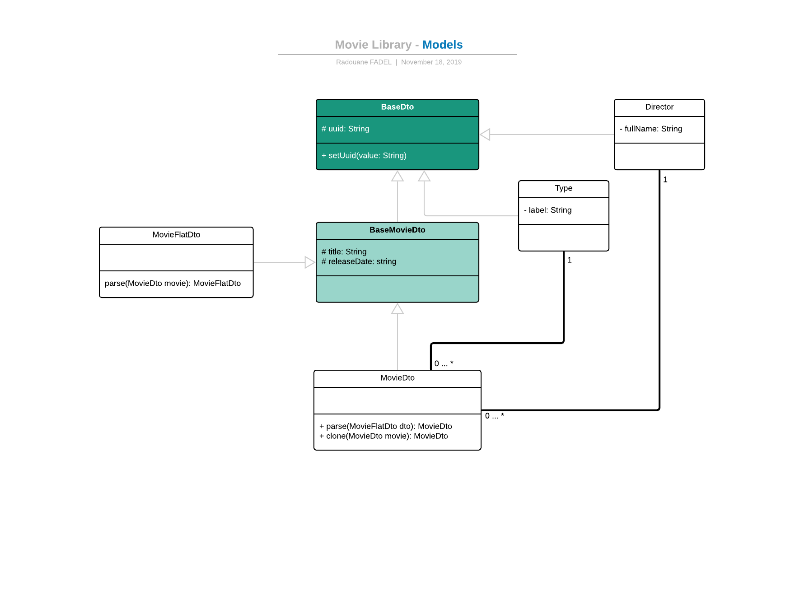
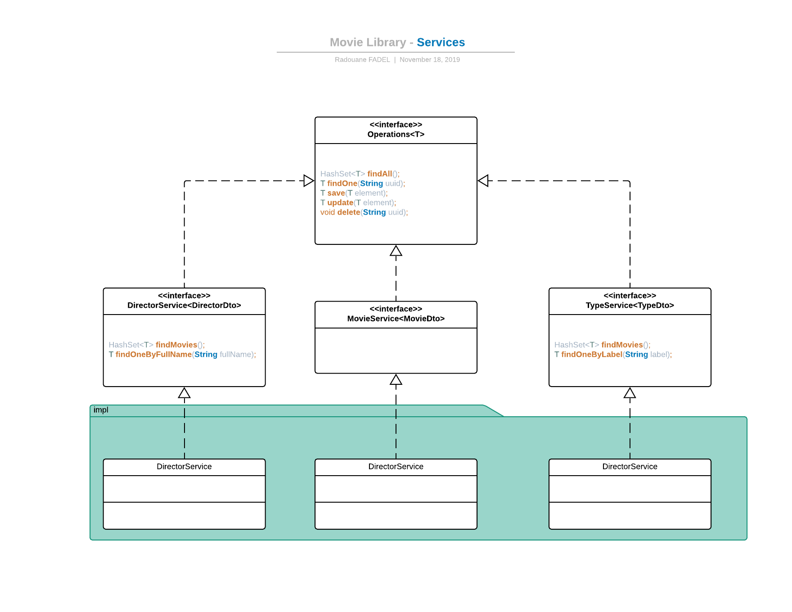
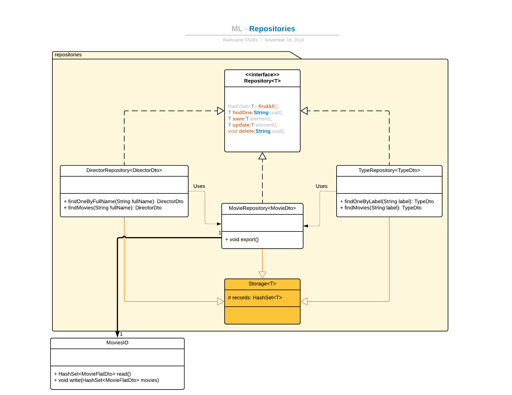

# Movie Library
This is a small project to manage movies.

## Quick start
#### REST API
##### Install dependencies
```console
mvn install
```
Or
```console
mvn package
```
##### Run REST API as a maven project
```console
mvn spring-boot:run
```
#### Front-end (Angular)
Run application by using **Angular-cli** and go to [http://localhost:4200]()
```console
ng serve
```
Click [here](src/main/resources/movies-app/README.md) to read more.

# Spring Boot application
## Dependencies
* Lombok;
* Jackson-databind;
* HATEOAS (not used yet).

## REST controllers
* **Movie Controller**
    * Get all movies `HashSet<MovieDTO> findAll()`;
    * Find movie by UUID `MovieDTO findOne(String uuid)`;
    * Add movie `MovieDTO save(MovieFlatDto movieDto)`;
    * Update movie `MovieDTO update(MovieFlatDto movieDto)`;
    * Delete movie `void delete(String uuid)`.
* **Director Controller**
    * Get all directors `HashSet<DirectorDto> findAll()`;
    * Find director by UUID `DirectorDto findOne(String uuid)`;
    * Find movies for by full name of director `DirectorDto findMovies(String fullName)`.
 * **Type Controller**
     * Get all types `HashSet<TypeDto> findAll()`;
     * Find type by UUID `TypeDto findOne(String uuid)`;
     * Find movies for by label of type `TypeDto findMovies(String label)`.
     
## Models

> Class [MovieFlatDto](src/main/java/com/maltem/relfadel/movieslib/dto/MovieFlatDto.java) is used to be coherent with stored data in JSON file.

## Services


## Repositories


## Interacting with JSON file
The [JSON file](ext/data/movies.json) is located at `~/ext/data/movies.json`

#### Configuration at application.properties
```properties
datasource.json.location=/data/movies.json
datasource.json.fullPath=ext/data/movies.json
```

#### Class MoviesIO
This is the main [class](src/main/java/com/maltem/relfadel/movieslib/util/MoviesIO.java) used to interact with JSON file and implementing the following methods:
* Read the JSON file `HashSet<MovieFlatDto> read()`;
* Append `void write(HashSet<MovieFlatDto> movies)`.
# Thank you!
